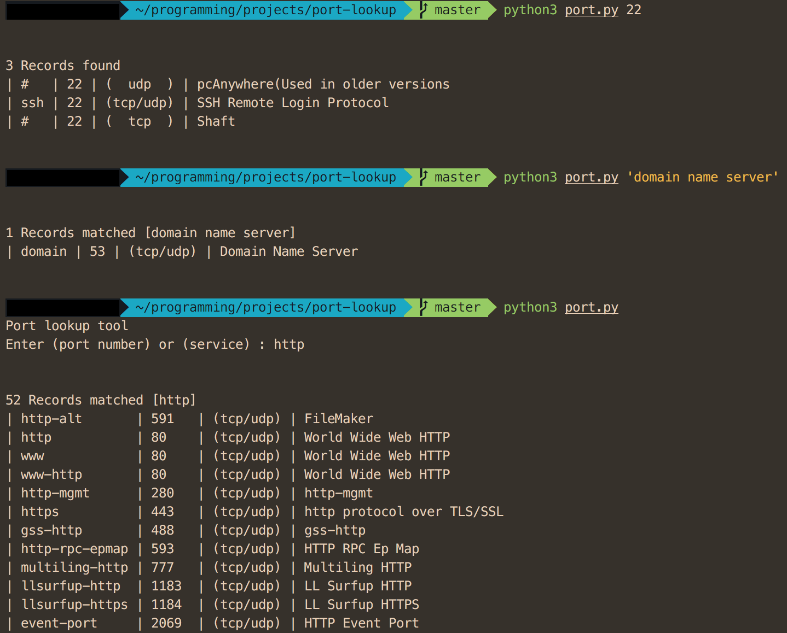

# port-lookup
A small tool to lookup the services associated with the TCP/UDP port numbers

port.csv file from [www.bekkoame.ne.jp](http://www.bekkoame.ne.jp/~s_ita/port/port.csv)





# Features

- type in "ssh" to find the ports related to the query "ssh"
- Or type in "22" to find the services related to "22"

It can be executed by itself, or run it followed by the query
`python3 portinfo.py ssh` or `python3 portinfo.py` and enter the query in prompt.

# Installation

Run `setup.py` file to install. It will execute the following commands automatically.

`python setup.py` will display necessary information. 
`sudo python setup.py install` to **install**.
`sudo python setup.py uninstall` to **uninstall**.

```sh
# install
sudo ln -s /path/of/this/project/portinfo.py /usr/local/bin/portinfo
sudo chmod 775 /usr/local/bin/portinfo

# uninstall
sudo rm /usr/local/bin/portinfo
```

# TODO

- [x] Print official port information first
- [x] Print in a table format nicely
- [ ] Write unittest code
- [ ] Maybe remove the class structure for records again. Since it's only running once, no need to create objects for all rows. It was designed that way at first because it run continuously until user chooses to quit.
- [ ] Make a sort so that the port number come up asending
- [x] ~~Write `Makefile` so user can just execute `sudo make install` to symlink it to system-wide path `/usr/local/bin/portinfo` or a `setup.py` file~~ Better yet, wrote a `setup.py` file for installation.
- [ ] Use regex to do a fuzzy search rather than using "in" operator?
